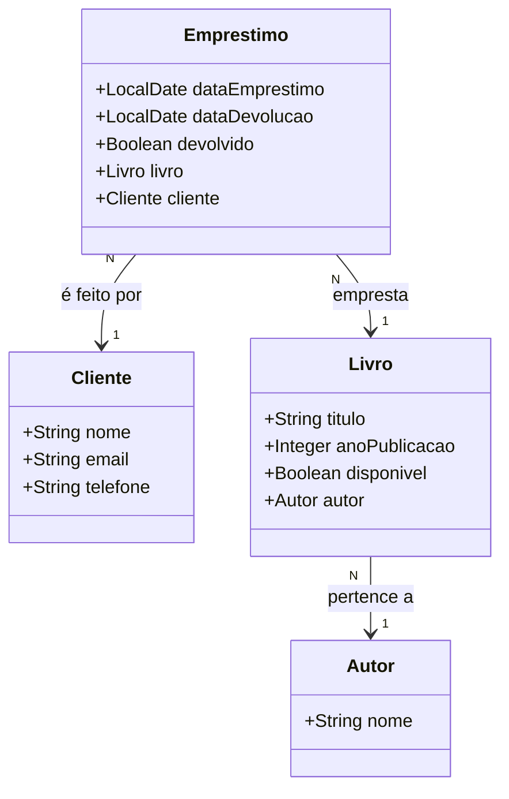

# API para Gerenciar uma Biblioteca
API para gerenciamento de livros, autores, clientes e empréstimos.
A API realiza operações de CRUD (Create, Read, Update, Delete) para as entidades com validação das requisições utilizando a anotação @Valid e tratamento adequado de exceções.
Cada livro é tratado como um único exemplar, ou seja, a API não contempla múltiplos exemplares de um mesmo título.
O sistema oferece uma maneira simples de gerenciar os empréstimos de livros, com validações para garantir a consistência dos dados e prevenir ações inválidas, 
como emprestar um livro indisponível ou cadastrar um cliente ou livro inexistente.

## Diagrama de classes

## Funcionalidades
- [x] URLs amigáveis no padrão REST
- [x] Validação de dados com @Valid nos DTOs
- [x] Erros de validação são retornados na resposta
- [x] Uso de DTO para prevenir manipulação de parâmetros
- [ ] Deploy no Railway
