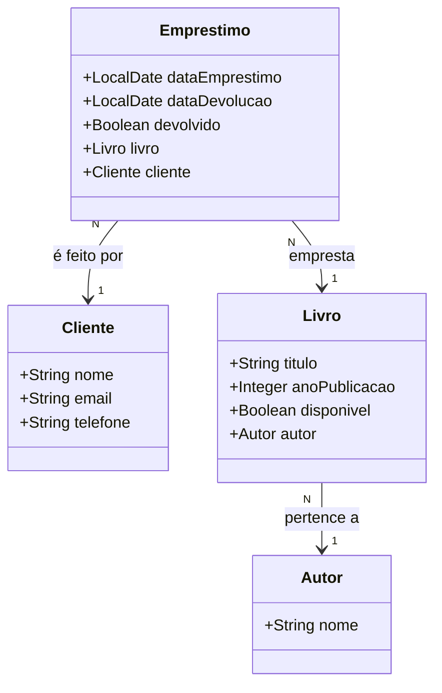

# API para Gerenciar uma Biblioteca
API para gerenciamento de livros, autores, clientes e empréstimos.
A API realiza operações de CRUD (Create, Read, Update, Delete) para as entidades com validação das requisições utilizando a anotação @Valid e tratamento adequado de exceções.
Cada livro é tratado como um único exemplar, ou seja, a API não contempla múltiplos exemplares de um mesmo título.
O sistema oferece uma maneira simples de gerenciar os empréstimos de livros, com validações para garantir a consistência dos dados e prevenir ações inválidas, 
como emprestar um livro indisponível ou cadastrar um cliente ou livro inexistente.

## Diagrama de classes

## Deploy no Railway
Caso queira testar a aplicação na nuvem, entre nesse link → [aqui](https://spring-api-biblioteca-production.up.railway.app/swagger-ui/index.html).

## Instalação
Após clonar e importar o repositório:
1. Configure o banco de dados:
- Para facilitar, use o banco de dados H2.
- Ele está no perfil dev e precisa ser ativo no arquivo [application.yml](https://github.com/wastecoder/spring-api-biblioteca/blob/main/src/main/resources/application.yml), alterando prd para dev.
- Como o ddl-auto está como create, todos os registros são perdidos cada vez ao iniciar o projeto.
2. **(opcional)** Caso queira ver o console do H2:
- Driver Class: org.h2.Driver
- JDBC URL: jdbc:h2:mem:testdb
- Username: sa
- Password: sa
- URL: http://localhost:8080/h2-console/
3. Execute o arquivo **ApiRestNuvemApplication** e entre no [Swagger](http://localhost:8080/swagger-ui.html).

## Funcionalidades
- [x] URLs amigáveis no padrão REST
- [x] Validação de dados com @Valid nos DTOs
- [x] Erros de validação são retornados na resposta
- [x] Uso de DTO para prevenir manipulação de parâmetros
- [x] Deploy no [Railway](https://spring-api-biblioteca-production.up.railway.app/swagger-ui/index.html)
